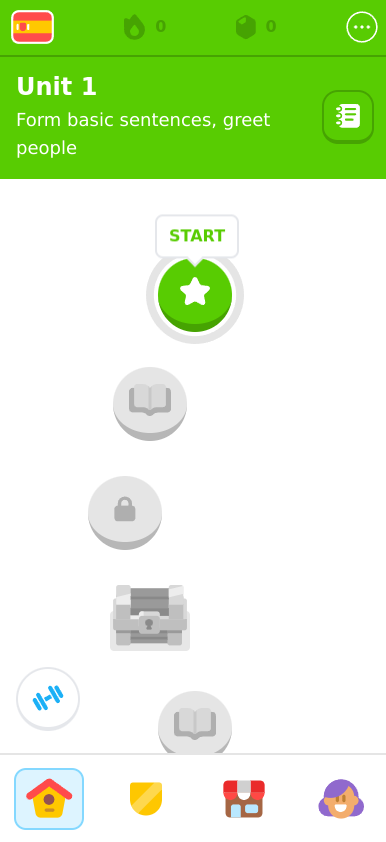
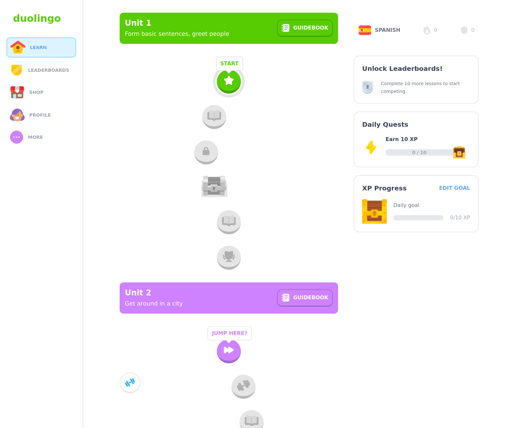

# React funacademy

https://funacademy.vercel.app/ 

A simple [funacademy](https://www.funacademy.com) web app clone written with [React](https://react.dev/), [TypeScript](https://www.typescriptlang.org/), [Next.js](https://nextjs.org/), [Tailwind](https://tailwindcss.com/), and [Zustand](https://github.com/pmndrs/zustand). I used [create-t3-app](https://github.com/t3-oss/create-t3-app) to initialize the project.




## Backend (feature/backend-foundation)

The app now has a real backend foundation: PostgreSQL (via [Neon](https://neon.tech)) + Prisma, session auth (email/password + Google OAuth), and an admin content model (Class 1–7 → Subjects → Units → Lessons → Questions).

### Environment variables

Set these in your hosting environment (Settings → Environment on Freebuff, or a local `.env.local`):

| Variable | Required | Purpose |
| --- | --- | --- |
| `DATABASE_URL` | Yes | PostgreSQL connection string, e.g. from Neon (`sslmode=require`) |
| `AUTH_SECRET` | Yes | Random secret for signing session JWTs (`openssl rand -hex 32`) |
| `GOOGLE_CLIENT_ID` | For Google login | OAuth client ID |
| `GOOGLE_CLIENT_SECRET` | For Google login | OAuth client secret |
| `GOOGLE_REDIRECT_URI` | Optional | Defaults to `{origin}/api/auth/google` |

### Setup

```bash
npm install
npx prisma migrate deploy   # create tables (or: npx prisma db push)
npm run db:seed             # classes 1-7 + subjects + demo Math course
npm run dev
```

### Admin console

Sign in with a user whose `role` is `ADMIN`, then visit `/admin` to manage classes, subjects, units, lessons, and questions.

To promote a user:

```sql
UPDATE "User" SET role = 'ADMIN' WHERE email = 'you@example.com';
```
